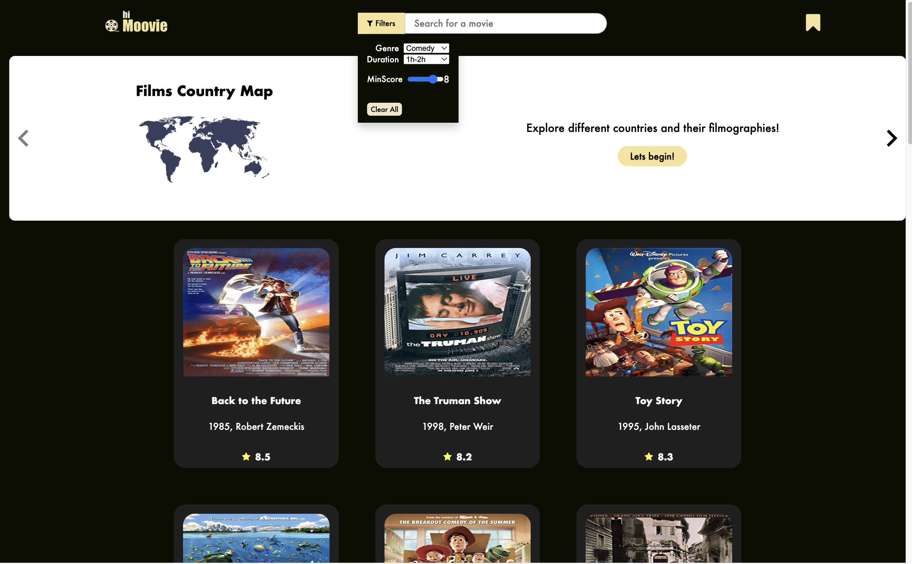
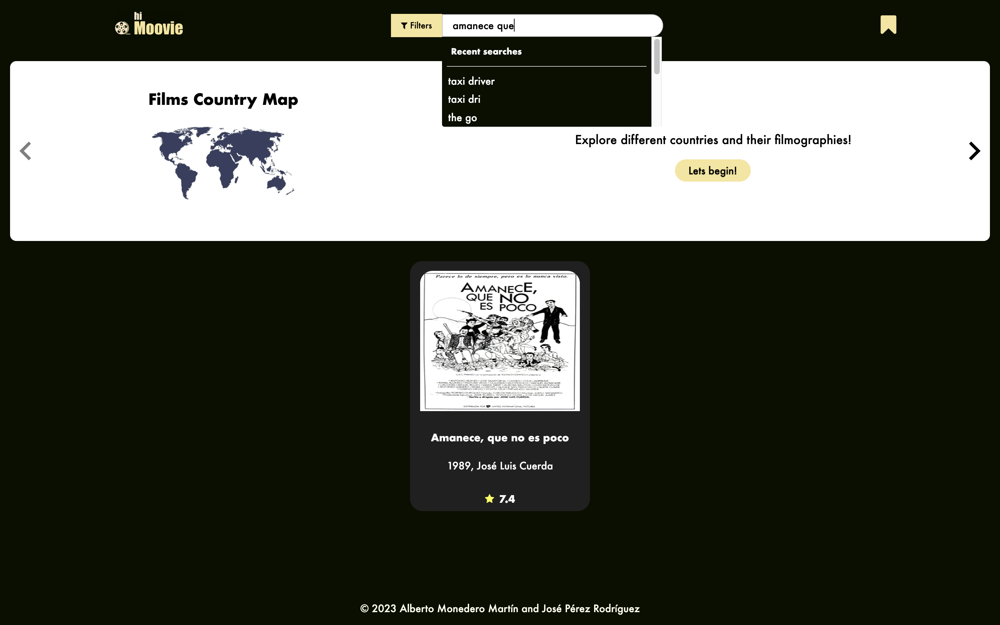
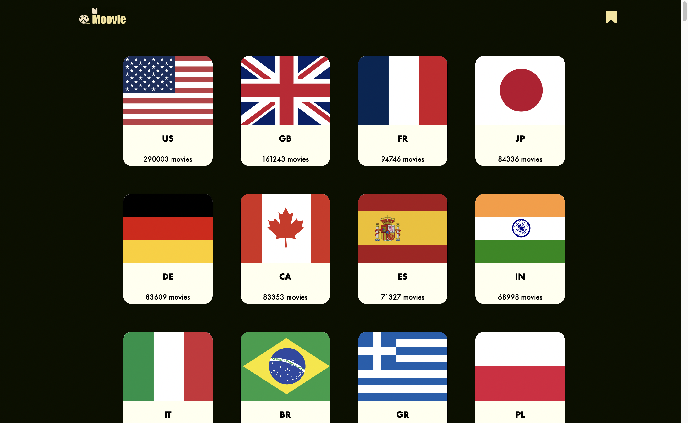

# IMDb front-end
Develop the front-end for the last project of the first half of the academy program, which involves creating an API using the IMDb database and consuming it in the front-end
## My partners repository (Back-end):

[José Pérez](https://github.com/josperrod9) - [IMDB Project](https://github.com/josperrod9/IMDb-project)
 
## Some screenshots:

